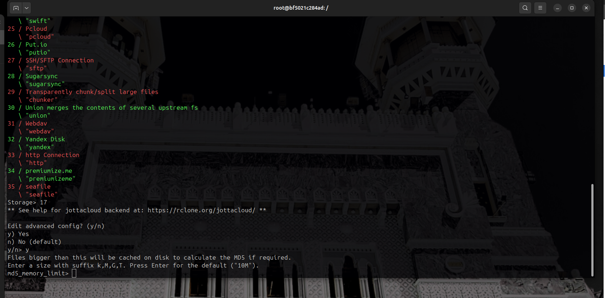
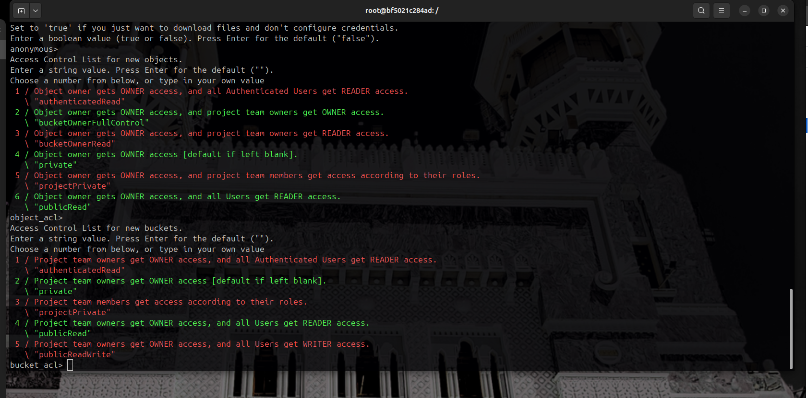
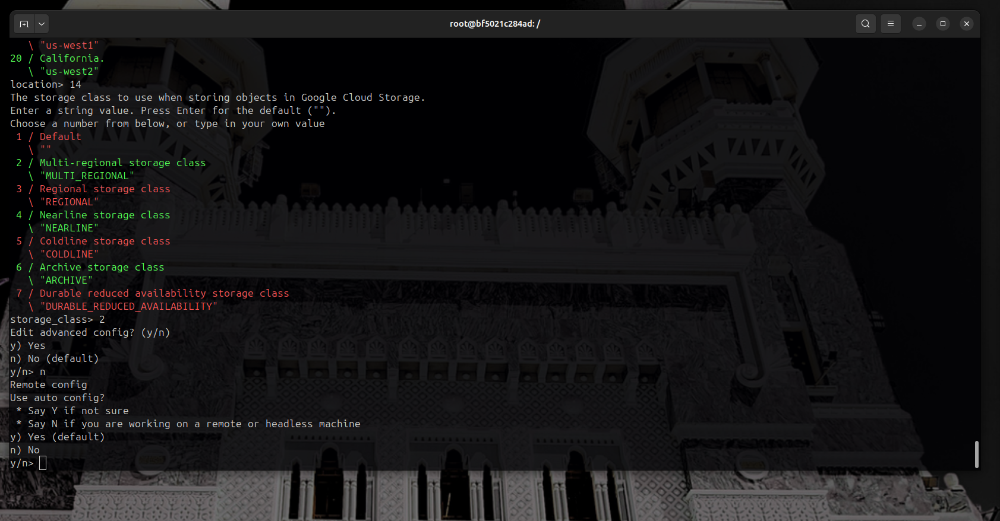

# 📊 Cost & Effort Analysis – GPT-OSS-20B LoRA Showcase

This document provides a transparent overview of the **time, costs, and team structure** behind the showcase run.  
It highlights not only the GPU rental cost but also the **real overhead** (rsync retries, CPU-only fallback, debugging).

---

## ⏱️ Time Breakdown

| Activity                | Solo Effort (h) | Team Effort (h) |
|-------------------------|-----------------|-----------------|
| Dataset preparation     | ~2h             | 1h              |
| Debugging/setup issues  | ~4h             | 2h              |
| → incl. rsync retries   | (~1h wasted)    | –               |
| Training & inference    | ~6–8h           | 4h              |
| Documentation & visuals | ~2h             | 1h              |
| **Total**               | **14–16h**      | **8–10h**       |

---

## 💵 Fictive Cost Estimate

Assuming an average **contractor/research rate** of 60–80 EUR/h:

- **Solo run:**  
  14–16h × 70 EUR ≈ **980–1,120 EUR**

- **Team of 3–4 (distributed tasks):**  
  8–10h × 3 × 70 EUR ≈ **1,680–2,100 EUR**

---

## 🖥️ Cloud GPU Costs

- **RunPod B200 Instance** (NVIDIA A100/H100 class)  
  - 28 vCPU, 180 GB RAM, CUDA 12.1, 50 GB Disk + 150 GB Pod Volume  
  - Rate: ≈ **5.99 USD/hour**  
  - Training run (~12h): **≈ 72 USD**

⚠️ Compared to human research time, **GPU costs are negligible**.  
The real value lies in expertise, debugging, and project orchestration.

---

## 🧑‍🤝‍🧑 Team Simulation

In a professional environment, this project would be distributed across several roles:

- **Data Engineer** – dataset preparation, cleaning, validation (2–3h)  
- **ML Engineer** – model training, debugging, GPU usage (6–8h)  
- **DevOps / Infra Specialist** – rsync, cloud storage config, monitoring (2h)  
- **Research Lead** – planning, approvals, scope definition (2h)  
- **Technical Writer** – documentation, screenshots, publishing (2h)

### Workflow
1. **Planning & Approval** → scope, dataset validation, resource allocation  
2. **Execution** → training & debugging by ML/Infra specialists  
3. **Review** → research lead & compliance check  
4. **Publication** → technical documentation and release  

---

## 🖼️ Visual Evidence: rsync Overhead

Real-world experiments are **never clean**. Rsync retries and cloud sync issues wasted ~1h.  
We intentionally keep these screenshots to show the **authentic overhead**.

- **Storage setup (Google Cloud Storage)**  
    

- **Bucket configuration & ACLs**  
    

- **Advanced config (chunking & union merges)**  
    

- **Rsync retries in action**  
    

---

## 📌 Key Takeaways
- **Solo mode:** One person covered all roles → ~14–16h.  
- **Team mode:** Shared workload reduces hours per person, but adds **planning & approval overhead**.  
- **Rsync overhead (~1h):** valuable to document, since such inefficiencies are **common in real projects**.  
- **GPU costs are minimal** compared to the **human expertise investment**.  
