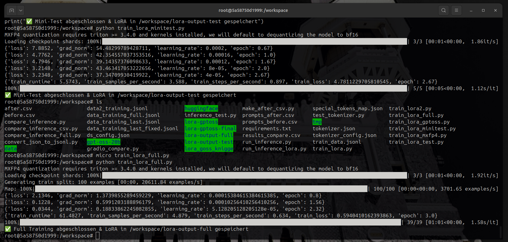

# 🕌 LoRA Training Showcase – GPT-OSS-20B + Custom Dua Dataset

## 🚀 Overview
This project documents a **showcase fine-tuning experiment** of the **GPT-OSS-20B model** with **LoRA** on a **custom Duʿāʾ dataset (inspired by Ḥiṣn al-Muslim)**.  

👉 Focus: **Arabic language, authentic Islamic supplications**  
👉 Uniqueness: Built entirely from scratch – dataset prep, debugging, training, inference, and visualization  
👉 Goal: Provide a **transparent research-style workflow** that others can replicate or extend  

⚠️ **Note:** Final model weights are not released.  
This repo serves as a **technical documentation & showcase**.

---

## ⏱️ Project Facts
- **Total time spent:** ~12–14h  
  - Debugging: ~4h (dataset fixes, rsync sync issues, initial CPU-only runs 😅)  
  - Training + Inference: ~6–8h  
  - Misc (setup, cleanup, monitoring): ~2h  

- **Hardware Environment:**  
  - **RunPod B200 Instance**  
  - 28 vCPU, 180 GB RAM, 50 GB Disk, 150 GB Pod Volume  
  - NVIDIA GPU (CUDA Capability `sm_100`) – shown as **B200**  
  - **PyTorch CUDA 12.1** (Torch available: `True`)  
  - Container: `runpod/pytorch:2.8.0-py3.11-cuda12.8.1-cudnn-devel`  

- **Frameworks:** HuggingFace Transformers, PEFT, PyTorch (CUDA), custom Python scripts  

- **Specialty:** OSS-20B with LoRA → **rarely documented on B200 hardware**  


---

## 📂 Repository Structure
```tree
gpt-oss-20b-lora-dua/
├── datasets/          # Training data (JSONL, CSV, tokenizer)
├── results/           # Inference results & comparisons
├── images/            # Screenshots & debug visuals
├── videos/            # Training & inference demos (via Git LFS)
├── scripts/           # Organized experiment scripts
│   ├── training/      # Training pipelines
│   ├── inference/     # Inference tests
│   ├── dataset_tools/ # Dataset checks & fixes
│   ├── compare/       # Compare runs & Gradio UI
│   └── tools/         # Utilities & helpers
└── utils/             # Environment configs & scanners
```

## 🛠️ Workflow

### 1. Dataset Preparation
- Base dataset curated from **Ḥiṣn al-Muslim Duʿāʾ**  
- Fixes applied using:
  - `fix_training_entry.py`
  - `check_dataset.py`
  - `convert_json_to_jsonl.py`

### 2. Debugging Phase
- **Issue:** GPU not used (ran on CPU by mistake 😅)  
- **Fix:** Verified ROCm setup, ensured `torch.cuda.is_available() = True`  
- Extra ~1h wasted on **rsync retries** – included here to show real-world overhead  

### 3. Mini-Test
- Ran LoRA on ~100 samples  
- Verified that adapters trained & merged properly  
- ✅ Confirmed inference pipeline working  

### 4. Full Training
- Trained on full dua dataset (`datasets/knigge_dua_dataset.jsonl`)  
- Saved LoRA adapters & merged back into base  

### 5. Merge & Export
- Used `merge_lora.py` to combine base + adapters  
- Exported in multiple quantized formats (**Q4, Q5, Q8**) locally  
- Files intentionally **not pushed to GitHub** (too large)  

### 6. Inference Showcase
- Tested with authentic Duʿāʾ prompts  
- Model produced **Arabic text, transliteration, and partial English gloss**  
- Outputs documented in `results/` and via screenshots in `images/`  

---

## 📊 Results

### ✅ Successes
- First documented LoRA fine-tune of **OSS-20B** on **RunPod B200 (CUDA 12)**  
- Dataset correction pipeline works robustly  
- Training reproducible (mini + full runs)  
- Model improved on Arabic + Islamic contexts  

### ⚠️ Limitations
- Dataset small (~100–200 examples)  
- Religious accuracy still requires scholar review  
- Cloud quirks → some wasted time (initial CPU-only runs, rsync overhead)  
  

---

## 📷 Media

### Screenshots
- **GPU Setup:**   
- **Mini-Test Success:**   
- **Inference Example:**   
- **Dataset Fix:**   

### Videos (via LFS in `/videos/`)
- **Training runs (mini + full):**  
  - [Mini-Test](videos/b200_training_MINITEST.mp4)  
  - [Full Training](videos/b200_training_FULL.mp4)  

- **Debugging sessions:**  
  - [Dataset Fix](videos/b200_FIX_data_entry-2025-08-20_13.41.22.mp4)  
  - [Merge Inference](videos/b200_MERGE_INFERENCE_LAST.mp4)  

- **Inference showcases:**  
  - [5 Prompts Before/After](videos/b200_5promptstraining_before_after.mp4)  
  - [Inference Run](videos/b200_INFERENCE_Test.mp4)  
  - [Quantization Showcase](videos/B200_MXFP4_quantization_6prompts_after.mp4)  


---

## 💡 Lessons Learned
- **RunPod B200 (CUDA 12)** works reliably once set up correctly  
- **LoRA is efficient** even on 20B parameter models  
- Debugging + real-world overhead (CPU fallback, rsync) matter just as much as training itself  
- Transparency (keeping even “mistakes”) helps others learn  

---

## 🎯 Conclusion
This repo demonstrates:  
- How to structure a **real LoRA fine-tune project** end-to-end  
- How to handle **dataset debugging, training, merging, inference**  
- How to use **cloud GPU instances (RunPod B200)** for large-scale experiments  

👉 A **hands-on showcase**, not a polished product – built for **education, research, and reproducibility**.  

